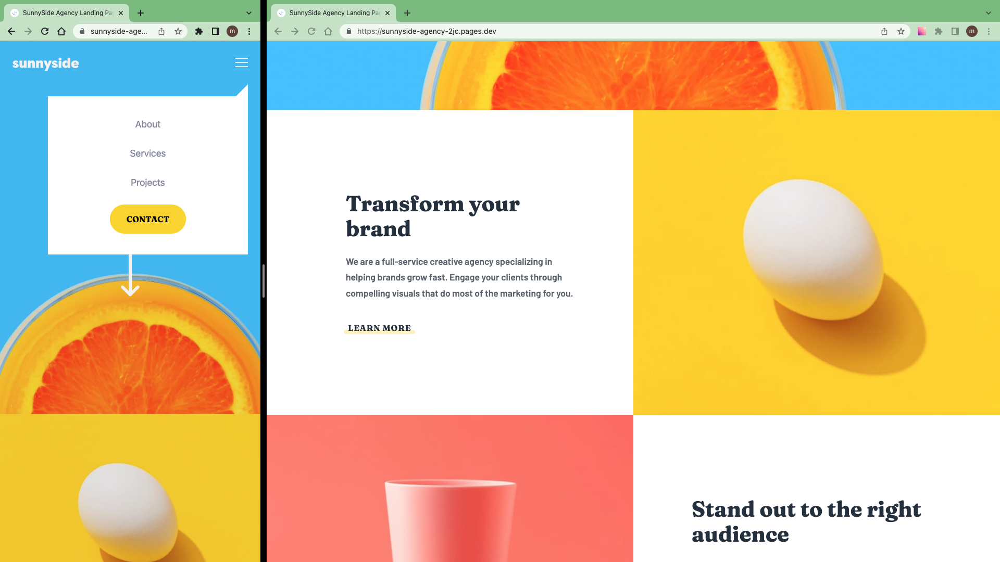

# Frontend Mentor - Sunnyside agency landing page solution

This is a solution to the [Sunnyside agency landing page challenge on Frontend Mentor](https://www.frontendmentor.io/challenges/sunnyside-agency-landing-page-7yVs3B6ef).

## Table of contents

- [Overview](#overview)
  - [The challenge](#the-challenge)
  - [Screenshot](#screenshot)
  - [Links](#links)
- [My process](#my-process)
  - [Work time](#work-time)
  - [Built with](#built-with)
- [Author](#author)
- [Acknowledgments](#acknowledgments)

## Overview

### The challenge

Users should be able to:

- View the optimal layout for the site depending on their device's screen size
- See hover states for all interactive elements on the page

### Screenshot

### Links

- Solution: [frontendmentor.io](https://www.frontendmentor.io/solutions/sunnyside-agency-landing-page-9G0U7e3H86)

- Live Site: [cloudflare](https://sunnyside-agency-2jc.pages.dev)

## My process

- Download assets, Install Vite & TailwindCss, Initialize git, README.md, Prepare project, ...
- Work on Sunnyday landing page
  - 1.Identify a component
  - 2.Create component
  - 3.style component
  - 4.Add functionality if exists
  - 5.go to step 1
  - Header, Menu, Hero, Services, Informs, Testimonials, Gallery, Footer

### Work Time

- [My Clockify Report](https://app.clockify.me/shared/649b45852ede6550eef31fe7)

### Built with

- [React](https://react.dev)
- [TailwindCss](https://tailwindcss.com/)
- [Framer Motion](https://framer.com/motion)

## Author

- Frontend Mentor - [@siavhnz](https://www.frontendmentor.io/profile/siavhnz)

- github - [@siavhnz](https://www.github.com/siavhnz)

## Acknowledgments

Thanks To

[Frontendmentor.io](https://www.frontendmentor.io/challenges) - for their Excitement challenges  

[Perfect Pixel](https://chrome.google.com/webstore/detail/perfectpixel-by-welldonec/dkaagdgjmgdmbnecmcefdhjekcoceebi?hl=en) - for such a great extension